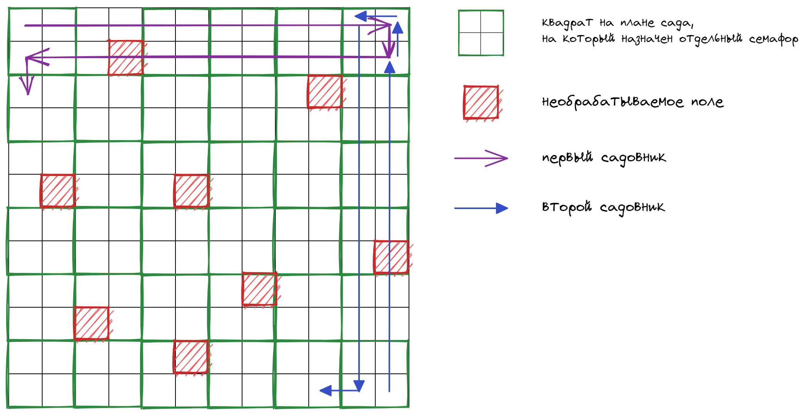

# Индивидуальное домашнее задание №2
<!-- no toc -->
#### Студент: Нечесов Андрей Львович
<!-- no toc -->
#### Группа: БПИ217
<!-- no toc -->
#### Вариант: 17

## Содержание
- [Содержание](#содержание)
- [Условие задачи](#условие-задачи)
- [Сценарий решаемой задачи](#сценарий-решаемой-задачи)
- [Формат запуска программ](#формат-запуска-программ)
  - [Программы на 4-6 баллов](#программы-на-4-6-баллов)
  - [Программы на 7-8 баллов](#программы-на-7-8-баллов)
- [Результаты работы программ](#результаты-работы-программ)
- [Описание реализации программ на 4-6 баллов](#описание-реализации-программ-на-4-6-баллов)
- [Критерии на 4 балла](#критерии-на-4-балла)
- [Критерии на 5 баллов](#критерии-на-5-баллов)
- [Критерии на 6 баллов](#критерии-на-6-баллов)
- [Описание реализации программ на 7-8 баллов](#описание-реализации-программ-на-7-8-баллов)
- [Критерии на 7 баллов](#критерии-на-7-баллов)
- [Критерии на 8 баллов](#критерии-на-8-баллов)


## Условие задачи
>Имеется пустой участок земли (двумерный массив) и план сада, разбитого на отдельные квадраты. От 10 до 30 процентов площади сада заняты прудами или камнями. То есть недоступны для ухаживания. Эти квадраты располагаются на плане произвольным образом. Ухаживание за садом выполняют два садовника, которые не хотят встречаться друг другом (то есть, одновременно появляться в одном и том же квадрате). Первый садовник начинает работу с верхнего левого угла сада и перемещается слева направо, сделав ряд, он спускается вниз и идет в обратном направлении, пропуская обработанные участки. Второй садовник начинает работу с нижнего правого угла сада и перемещается снизу вверх, сделав ряд, он перемещается влево и также идет в обратную сторону. Если садовник видит, что участок сада уже обработан другим садовником или является необрабатываемым, он идет дальше. Если по пути какой-то участок занят другим садовником, то садовник ожидает когда участок освободится, чтобы пройти дальше. Садовники должны работать одновременно со скоростями, определяемыми как параметры задачи. Прохождение через любой квадрат занимает некоторое время, которое задается константой, меньшей чем времена обработки и принимается за единицу времени. Создать приложение, моделирующее работу садовников. Каждого садовника представить отдельным процессом.

## Сценарий решаемой задачи
В данной задачи сущность садовника проецируется на процесс.  

Пустой участок земли, как и описано в условии, представляется двумерным массивом.  

Этот массив "разделен" на квадраты 2x2 &mdash; план сада. 

Каждому квадрату на плане сада соответствуют семафор. Если садовник пытается зайти в некоторую территорию (ячейка двумерного массива), он пытается заблокировать семафор соответствующий квадрату на плане, в который входит данная территория.  

Такой формат позволяет сократить количество создаваемых семафоров.

Обрабатывая поле, садовник записывет в ячейку массива свой номер.

Двумерный массив заполняется следующими числами:
* 0 &mdash; поле никто не обработал
* -1 &mdash; поле является необрабатываемым (отображается в `X` в выводе)
* 1 &mdash; поле обработал первый садовник
* 2 &mdash; поле обработал второй садовник

Время прохождения через пустой или уже обработный квадрат определяется как `working_time / EMPTY_PLOT_COEFFICIENT`, где `EMPTY_PLOT_COEFFICIENT = 2` в данной реализации.

<p align="center">

</p>

## Формат запуска программ
### Программы на 4-6 баллов
```console
make
./program field_size first_gardener_working_time second_gardener_working_time
```
`field_size` &mdash; количество больших квадратов в строке/столбце (размер двумерного массива = `(2 * field_size) x (2 * field_size)`)  

`first_gardener_working_time` &mdash; время в миллисекундах, за которое первый садовник обрабатывает поле.  

`second_gardener_working_time` &mdash; время в миллисекундах, за которое первый садовник обрабатывает поле.
### Программы на 7-8 баллов
```console
make
./run.sh field_size first_gardener_working_time second_gardener_working_time
```
Параметры аналогичны программа на 4-6 баллов

## Результаты работы программ
После каждого вывода сообщения на экран производился сброс буффера, поэтому вывод программ получилось адекватно перенаправить в файлы.

Для каждой из написанных программ проводились запуски на следующих данных:
1. field_size = 15, first_gardener_working_time = 10, second_gardener_working_time = 10 
2. field_size = 15, first_gardener_working_time = 2, second_gardener_working_time = 10
3. field_size = 15, first_gardener_working_time = 10, second_gardener_working_time = 2
   
Результаты вывода расположены по следующему пути:
grade-<кол-во баллов>/output/log<номер теста>

Например, для программы на 4 балла вывод программы на 1 тесте расположен по следующему пути: [grade-04/output/log1](grade-04/output/log1)
## Описание реализации программ на 4-6 баллов
Подход к решению задачи очень схож, поэтому описан алгоритм вне зависимости от используемых инструментов.

Родительский процесс сначала создает разделяемую память и заданное количество семафоров, затем запускает двух процессов-садовников, которые обходят поле. Когда садовники заканчивают свою работу. Рождительский процесс закрывает ресурсы и уничтожает: разделяемую память и семафоры.  

При отправке сигнала о прерывании с клавиатуры родительский процесс сначала завераешт исполнение дочерних потоков, отправляя им сигнал, а затем закрывает ресурсы и уничтожает: разделяемую память и семафоры.  
## Критерии на 4 балла
Программа на 4 балла реализует исходную задачу со следующим условием:
> Множество процессов взаимодействуют с использованием именованных POSIX семафоров. Обмен данными ведется через
разделяемую память в стандарте POSIX.

Исходные коды программы: [grade-04/](grade-04/)  
Вывод программы: [grade-04/output/](grade-04/output/)
## Критерии на 5 баллов
Программа на 5 баллов реализует исходную задачу со следующим условием:
> Множество процессов взаимодействуют с использованием неименованных POSIX семафоров расположенных в разделяемой памяти. Обмен данными также ведется через разделяемую память в стандарте POSIX

Исходные коды программы: [grade-05/](grade-05/)  
Вывод программы: [grade-05/output/](grade-05/output/)
## Критерии на 6 баллов
Программа на 6 баллов реализует исходную задачу со следующим условием:
> Множество процессов взаимодействуют с использованием семафоров в стандарте UNIX SYSTEM V. Обмен данными ведется через разделяемую память в стандарте UNIX SYSTEM
V

Исходные коды программы: [grade-06/](grade-06/)  
Вывод программы: [grade-06/output/](grade-06/output/)
## Описание реализации программ на 7-8 баллов
Взаимодействуют три процесса: два садовника и генератор карты. Есть семафор, который изначально находится в заблокированном состоянии. Блокировку с него снимает генератор карты, когда создает разделяемую память и семафоры для работы с участком. После этого садовники начинают работать. После прохождения всего поля они увеличивают значения другого семафора. Как только его значение достигает двух, генератор карты удаляет все семафоры и разделяемую память, а затем заканчивает свою работу.

Чтобы корректно организовать завершние работы по прерыванию с клавиатуры, процессы хранят в разделяемой память свои `pid`. Как только один процесс получает сигнал, он уведомляет посредством сигнала другие процессы. Удалением общих ресурсов также занимается генератор карты (по сути он выполняет ту же самую роль, что и родительский процесс в прошлых программах).
## Критерии на 7 баллов
Программа на 7 баллов реализует исходную задачу со следующим условием:
> Множество независимых процессов взаимодействуют с использованием именованных POSIX семафоров. Обмен данными ведется через разделяемую память в стандарте POSIX.

Исходные коды программы: [grade-07/](grade-07/)  
Вывод программы: [grade-07/output/](grade-07/output/)
## Критерии на 8 баллов
Программа на 8 баллов реализует исходную задачу со следующим условием:
> Множество независимых процессов взаимодействуют с использованием семафоров в стандарте UNIX SYSTEM V. Обмен данными ведется через разделяемую память в стандарте UNIX
SYSTEM V

Исходные коды программы: [grade-08/](grade-08/)  
Вывод программы: [grade-08/output/](grade-08/output/)
  